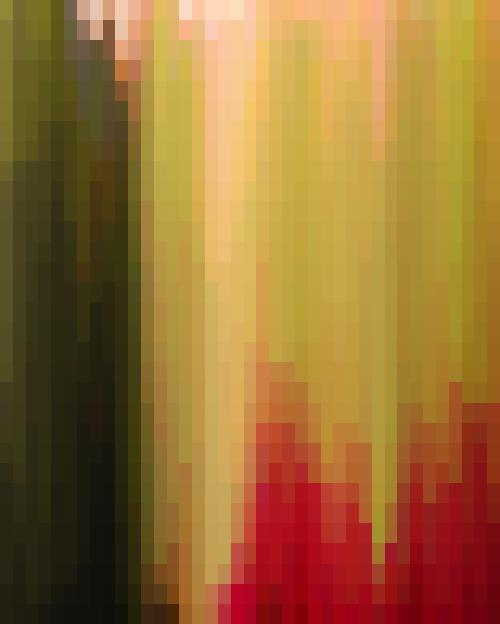
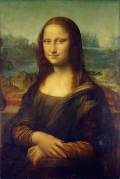
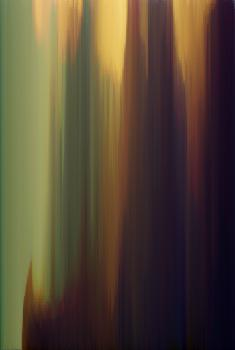
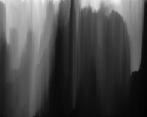

# Pixelize

`pixelize` is a tool to make glitch art from source images, based on the work in
[this article](http://theorangeduck.com/page/generating-icons-pixel-sorting) by
[orangeduck](https://github.com/orangeduck).

## Usage

`pixelize` uses [`invoke`](http://www.pyinvoke.org/) for command line argument parsing
and fork-friendliness to extend the tool at your leisure.

```shell
$ invoke pixelize --output-width=2048 --sampling-factor=32 someimage.jpg
```

See all options with `invoke --help pixelize`

## Examples

Parameters | In | Out
---------- | -- | ---
`sampling_factor`: 16 |  | 
`sampling_factor`: 1 |  | 
`sampling_factor`: 1 |  | 
